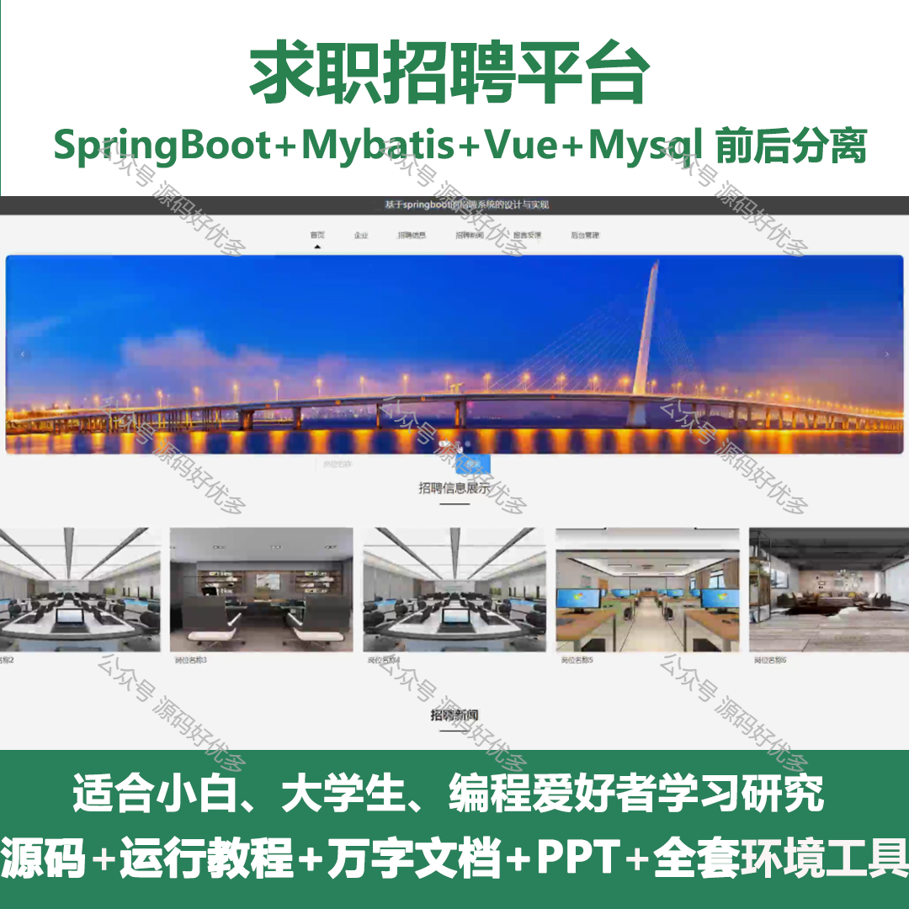
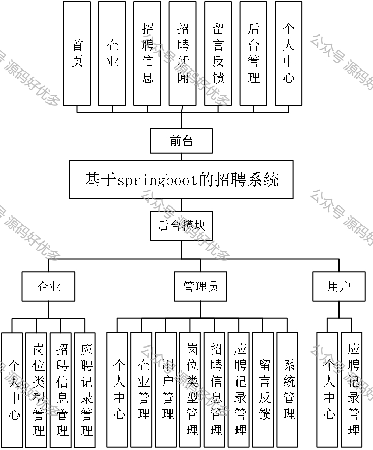
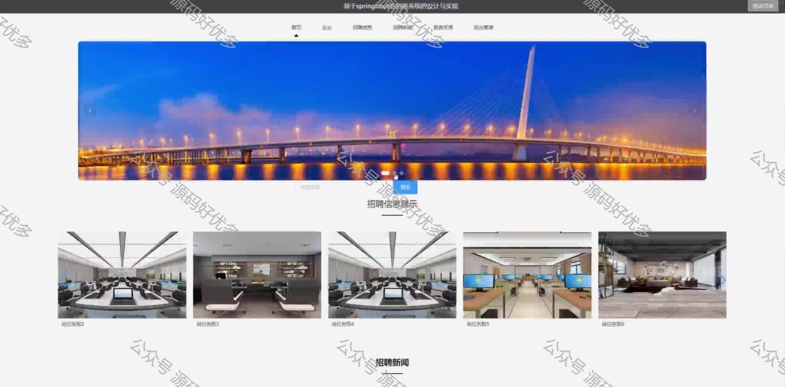
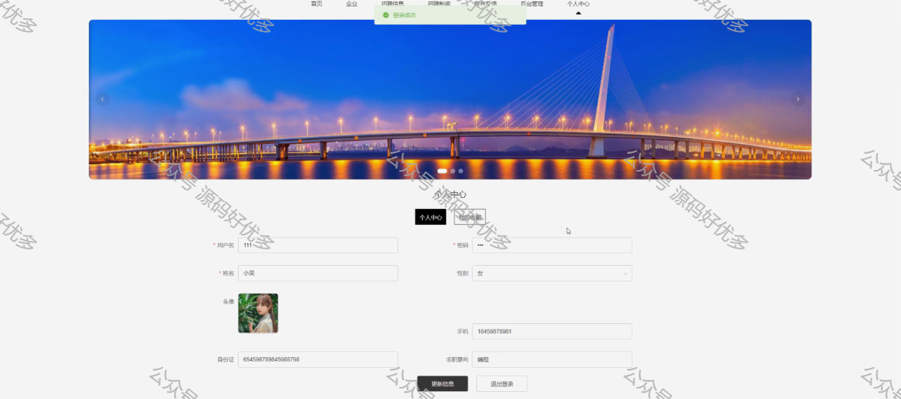
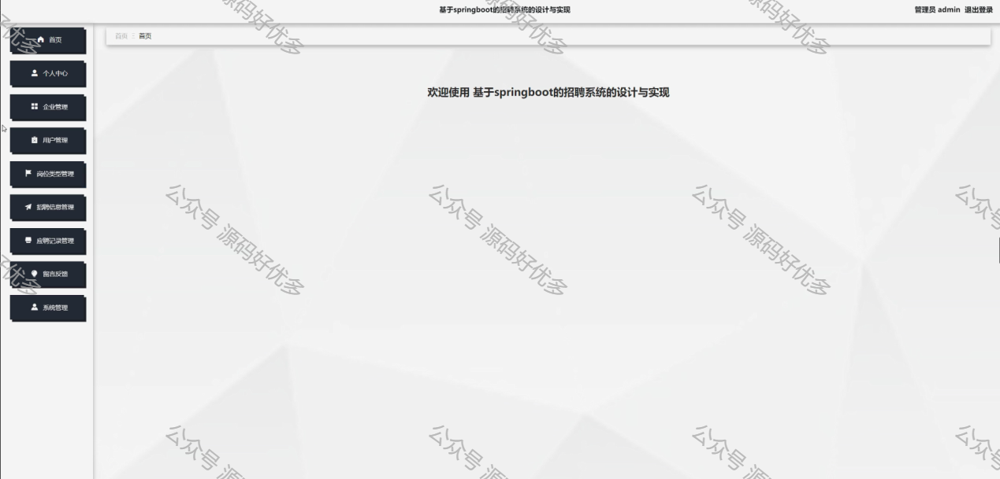
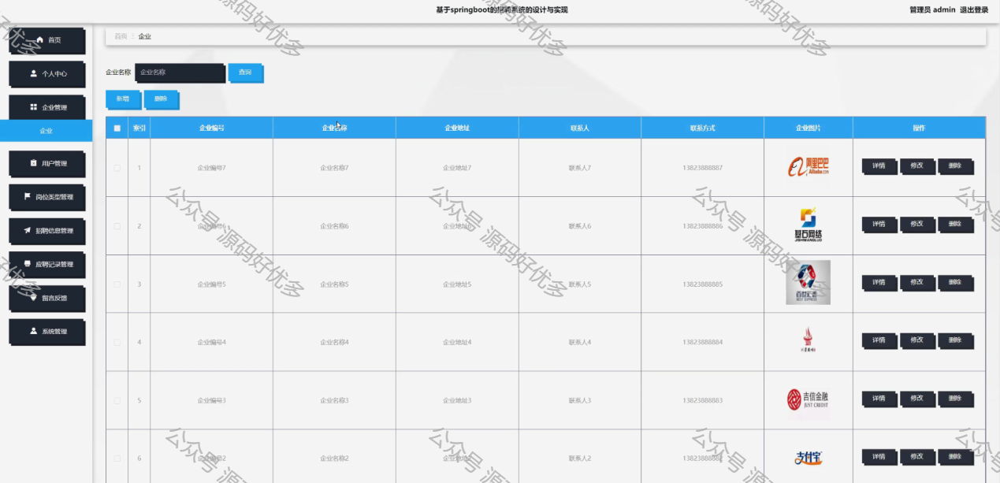
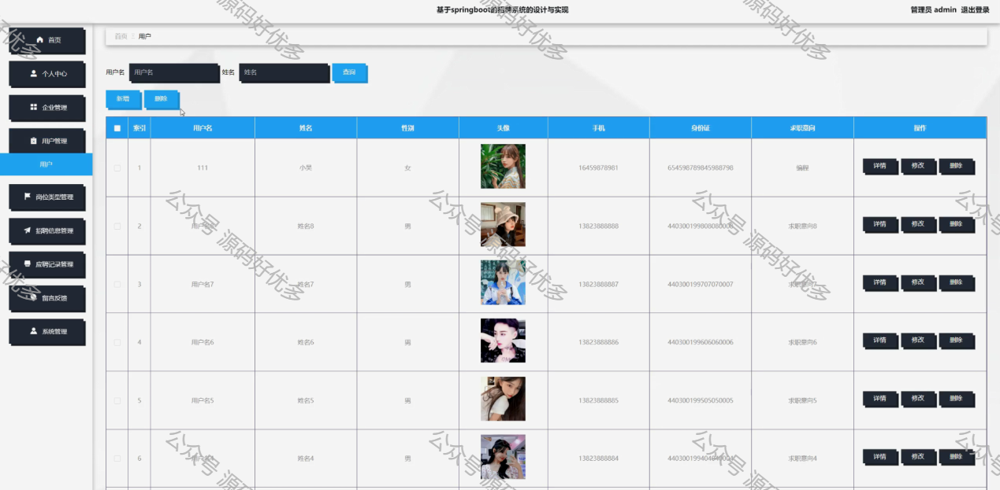
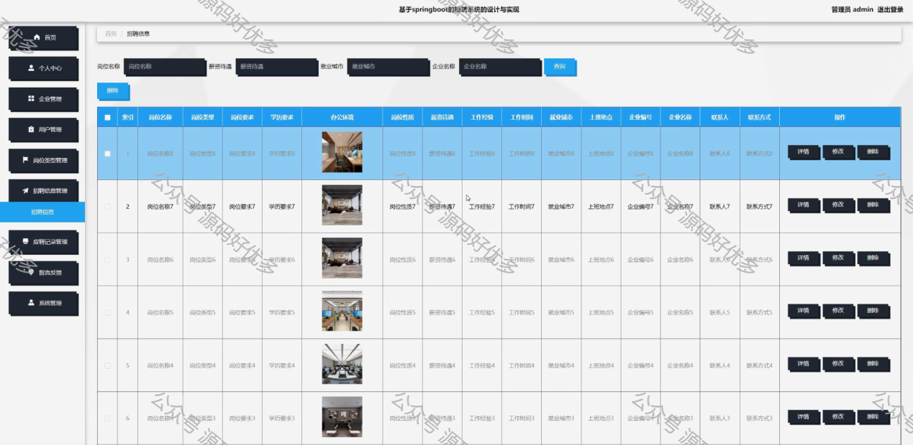
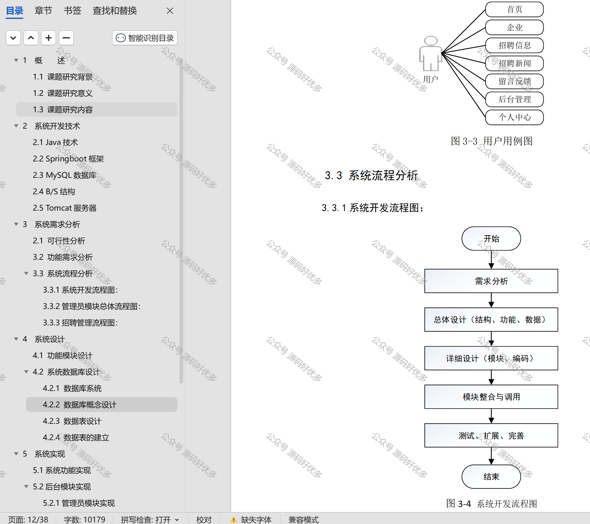

 
## 查看主页获取源码

### 一、作品包含

源码+数据库+设计文档万字+PPT+全套环境和工具资源+部署教程

### 二、项目技术

前端技术：Html、Css、Js、Vue、Element-ui

数据库：MySQL

后端技术：Java、Spring Boot、MyBatis

  

### 三、运行环境

开发工具：IDEA/eclipse

数据库：MySQL5.7

数据库管理工具：Navicat10以上版本

环境配置软件： JDK1.8+Maven3.6.3

前端Nodejs：14

### 四、项目介绍
项目编号：springbootA348

求职招聘系统对企业和求职者都具有重要作用，主要体现在提高招聘效率、优化招聘流程、扩大人才选择范围、增强品牌形象、促进人才流动、提升招聘体验等方面。

这个系统包括企业、管理员和用户三个主要角色。企业的功能包括对个人的信息进行管理、对招聘岗位的信息进行管理、对求职者的应聘记录进行管理以及个人中心的信息管理；管理员的功能包括对用户的信息进行管理、对企业进行管理、对岗位的类型进行管理、对招聘信息进行管理以及对用户的留言反馈进行管理；而用户的功能则可以对个人信息进行管理也可以对求职记录进行管理。

### 五、运行截图

  
